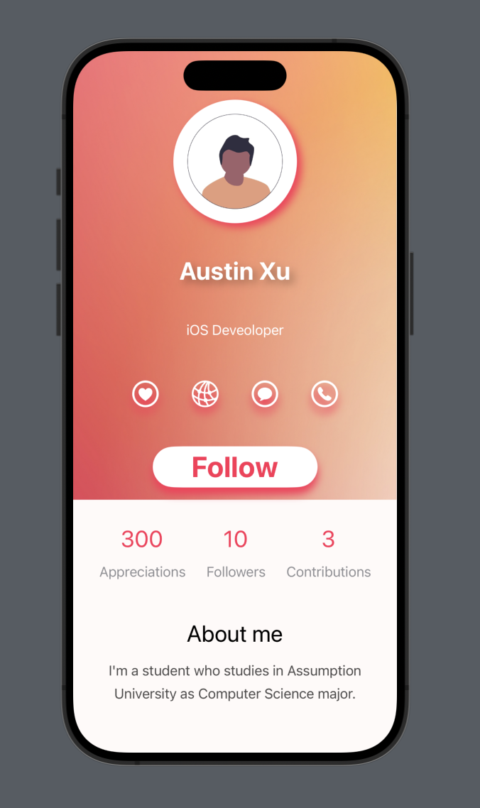

# ProfileAppWorkshop

## A Profile App developed with Swift UI which includes
* ZStack, VStack, and HStack
* Text, Button, Image, Shape
* SF Symbols
  

## A Setting for managing state and binding data for profile
* List, Form, Section
* Toggle, Picker, Datepicker, Navigation Stack and Navigation Link

